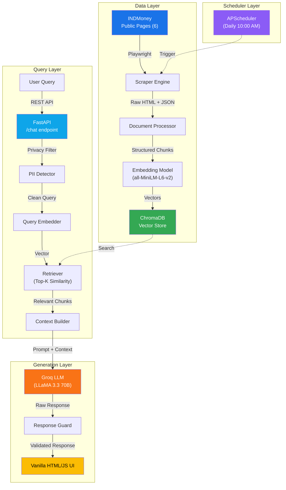
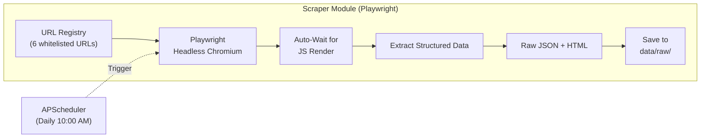
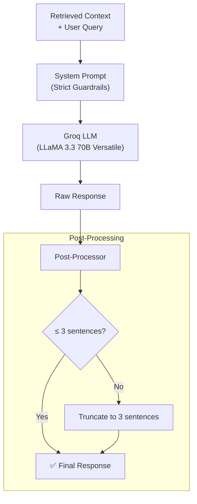
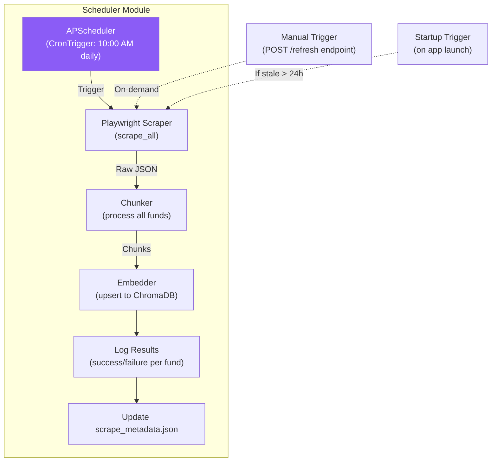
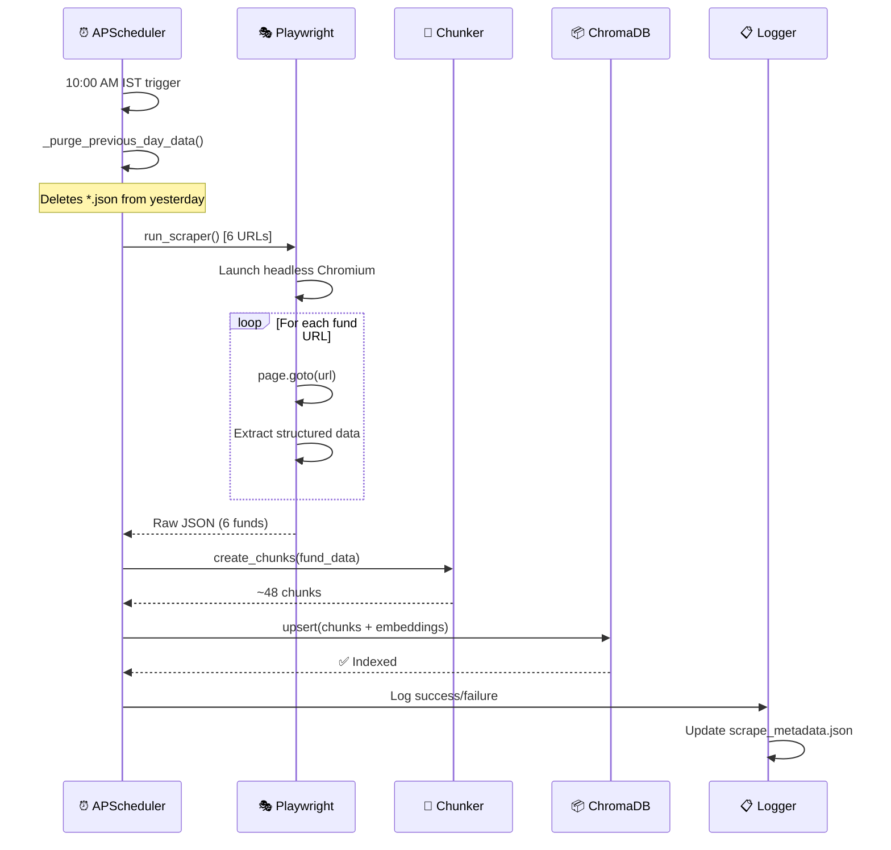
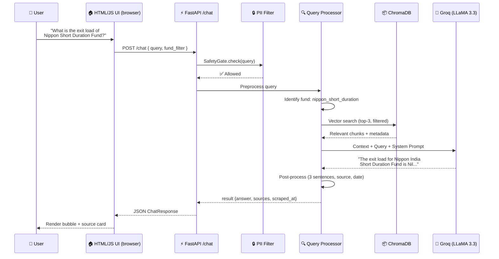

# 🏗️ RAG-Based Mutual Fund FAQ Chatbot — Phase-Wise Architecture

> A production-ready Retrieval-Augmented Generation chatbot that answers factual mutual fund questions using **only** official INDMoney public pages as its knowledge base.

---

## Table of Contents

1. [System Overview](#system-overview)
2. [Phase 1 — Data Ingestion & Scraping (Playwright)](#phase-1--data-ingestion--scraping-playwright)
3. [Phase 2 — Document Processing & Chunking](#phase-2--document-processing--chunking)
4. [Phase 3 — Embedding & Vector Store](#phase-3--embedding--vector-store)
5. [Phase 4 — RAG Query Pipeline](#phase-4--rag-query-pipeline)
6. [Phase 5 — Privacy, Safety & Compliance Layer](#phase-5--privacy-safety--compliance-layer)
7. [Phase 6 — LLM Response Generation with Guardrails (Groq)](#phase-6--llm-generation)
8. [Phase 7 — Frontend & Backend](#phase-7--frontend--backend-fastapi-vanilla-htmljs)
9. [Phase 8 — Testing, Monitoring & Maintenance](#phase-8--testing-monitoring--maintenance)
10. [Phase 9 — Automated Daily Scheduler](#phase-9--automated-daily-scheduler)
11. [Phase 10 — Vercel Serverless Deployment](#phase-10--vercel-serverless-deployment)
12. [Directory Structure](#directory-structure)
13. [Technology Stack](#technology-stack)
14. [Data Flow Diagram](#data-flow-diagram)
15. [Allowed Sources Registry](#allowed-sources-registry)

---

## System Overview



### Core Principles

| Principle | Implementation |
|-----------|---------------|
| **Factual Only** | LLM constrained to retrieved context; no hallucination |
| **Source Attribution** | Displayed in a dedicated UI source card; clickable links |
| **No Advice** | System prompt explicitly prohibits recommendations |
| **No Computation** | Returns/comparisons redirect to official factsheets |
| **Privacy First** | PII regex filter blocks sensitive data at ingestion |
| **Concise** | Hard ≤3 sentence limit enforced in prompt + post-processing |
| **Freshness Stamp** | Displayed in the UI source card: `Last updated from sources: <date>` |
| **Auto-Purge** | Scheduler deletes previous days' files before every re-scrape |
| **Auto-Refresh** | Daily scheduler re-scrapes all sources at 10:00 AM IST |

---

## Phase 1 — Data Ingestion & Scraping (Playwright)

### 1.1 Objective
Scrape structured factual data from the 6 official INDMoney mutual fund pages using **Playwright** browser automation (these are JavaScript-rendered SPAs that return 403 to simple HTTP requests).

> [!IMPORTANT]
> **Playwright** is used instead of Selenium because it offers built-in async support, auto-waiting for elements, faster execution with multiple browser contexts, and a more reliable API for modern JS-heavy SPAs.

### 1.2 Architecture



### 1.3 Key Components

#### `scraper/config.py` — URL Registry (Whitelist)
```python
ALLOWED_SOURCES = {
    "nippon_elss_tax_saver": {
        "url": "https://www.indmoney.com/mutual-funds/nippon-india-elss-tax-saver-fund-direct-plan-growth-option-2751",
        "fund_name": "Nippon India ELSS Tax Saver Fund - Direct Plan Growth",
        "category": "ELSS / Tax Saver",
    },
    "nippon_nifty_auto_index": {
        "url": "https://www.indmoney.com/mutual-funds/nippon-india-nifty-auto-index-fund-direct-growth-1048613",
        "fund_name": "Nippon India Nifty Auto Index Fund - Direct Growth",
        "category": "Index Fund / Sectoral",
    },
    "nippon_short_duration": {
        "url": "https://www.indmoney.com/mutual-funds/nippon-india-short-duration-fund-direct-plan-growth-plan-2268",
        "fund_name": "Nippon India Short Duration Fund - Direct Plan Growth",
        "category": "Debt / Short Duration",
    },
    "nippon_crisil_ibx_aaa": {
        "url": "https://www.indmoney.com/mutual-funds/nippon-india-crisil-ibx-aaa-financial-svcs-dec-2026-idx-fd-dir-growth-1048293",
        "fund_name": "Nippon India CRISIL IBX AAA Financial Svcs Dec 2026 Index Fund - Direct Growth",
        "category": "Debt / Target Maturity",
    },
    "nippon_silver_etf_fof": {
        "url": "https://www.indmoney.com/mutual-funds/nippon-india-silver-etf-fund-of-fund-fof-direct-growth-1040380",
        "fund_name": "Nippon India Silver ETF Fund of Fund (FOF) - Direct Growth",
        "category": "Commodity / Silver",
    },
    "nippon_balanced_advantage": {
        "url": "https://www.indmoney.com/mutual-funds/nippon-india-balanced-advantage-fund-direct-growth-plan-4324",
        "fund_name": "Nippon India Balanced Advantage Fund - Direct Growth Plan",
        "category": "Hybrid / Balanced Advantage",
    },
}
```

#### `phase1_scraping/indmoney_scraper.py` — Playwright Scraper

**Scraping Strategy:**
```python
import asyncio
from playwright.async_api import async_playwright
import json, datetime
from phase1_scraping.config import ALLOWED_SOURCES, SCRAPER_CONFIG

class INDMoneyScraper:
    """Playwright-based async scraper for INDMoney fund pages."""

    async def _launch_browser(self):
        self.playwright = await async_playwright().start()
        self.browser = await self.playwright.chromium.launch(
            headless=SCRAPER_CONFIG["headless"],
            args=SCRAPER_CONFIG["browser_args"]
        )
        self.context = await self.browser.new_context(
            user_agent=SCRAPER_CONFIG["user_agent"],
            viewport=SCRAPER_CONFIG["viewport"],
        )

    async def scrape_fund_page(self, url: str, fund_key: str) -> dict:
        """Scrape a single fund page and return structured data."""
        page = await self.context.new_page()
        try:
            await page.goto(url, wait_until="networkidle", timeout=30000)
            await page.wait_for_selector("main", timeout=15000)

            # Extract full page text for fallback
            raw_text = await page.inner_text("main")

            data = {
                "fund_key": fund_key,
                "source_url": url,
                "scraped_at": datetime.datetime.now().isoformat(),
                "raw_text": raw_text,
                "fields": {
                    "fund_name": await page.title(),
                    # ... complex extraction logic ...
                }
            }
            return data
        finally:
            await page.close()

    async def scrape_all(self) -> list[dict]:
        """Scrape all whitelisted fund pages."""
        await self._launch_browser()
        results = []
        for key, config in ALLOWED_SOURCES.items():
            data = await self.scrape_fund_page(config["url"], key)
            results.append(data)
        await self.browser.close()
        await self.playwright.stop()
        return results
```

### 1.4 Output
```
data/
├── raw/
│   ├── nippon_elss_tax_saver_2026-03-02.json
│   ├── nippon_nifty_auto_index_2026-03-02.json
│   ├── nippon_short_duration_2026-03-02.json
│   ├── nippon_crisil_ibx_aaa_2026-03-02.json
│   ├── nippon_silver_etf_fof_2026-03-02.json
│   └── nippon_balanced_advantage_2026-03-02.json
└── scrape_metadata.json          # timestamps, success/failure log
```

### 1.5 Why Playwright over Selenium

| Feature | Playwright ✅ | Selenium |
|---------|-------------|----------|
| Auto-wait for elements | Built-in | Manual `WebDriverWait` |
| Async support | Native `async/await` | Requires wrapping |
| Browser contexts | Lightweight, parallel | Heavy driver instances |
| Network interception | Built-in `route()` | Requires proxy setup |
| Speed | Faster (single browser, many contexts) | Slower (one driver per tab) |
| Selector engine | CSS, XPath, text, role | CSS, XPath only |
| Installation | `playwright install chromium` | Needs ChromeDriver binary |

### 1.6 Error Handling & Resilience

| Scenario | Strategy |
|----------|----------|
| Page structure changed | Log warning, use fallback `raw_text` extraction |
| 403 / Rate limiting | Exponential backoff (2s → 4s → 8s), max 3 retries |
| Element not found | Return `null` for field, continue extraction |
| Network timeout | 30s timeout, retry with fresh browser context |
| Complete failure | Alert via log, serve stale data with warning |

---

## Phase 2 — Document Processing & Chunking

### 2.1 Objective
Transform raw scraped data into semantically meaningful, retrieval-optimized text chunks with full provenance metadata.

### 2.2 Chunking Strategy

> [!IMPORTANT]
> Each chunk must be **self-contained** — it should make sense without needing other chunks.

**Chunk Types (per fund):**

| Chunk ID Pattern | Content |
|------------------|---------|
| `{fund}_overview` | Fund name, category, AMC, AUM, fund manager |
| `{fund}_expense_exit` | Expense ratio + exit load |
| `{fund}_sip_investment` | Min SIP, min lumpsum, SIP dates |
| `{fund}_risk_benchmark` | Riskometer level, benchmark index |
| `{fund}_lockin_tax` | Lock-in period, ELSS-specific rules |
| `{fund}_returns` | Historical returns (1Y, 3Y, 5Y) |
| `{fund}_holdings` | Top holdings, sector allocation |
| `{fund}_faq_{n}` | Individual FAQ Q&A pairs |

#### `processing/chunker.py`

```python
from dataclasses import dataclass

@dataclass
class DocumentChunk:
    chunk_id: str
    fund_name: str
    fund_key: str
    source_url: str
    chunk_type: str
    content: str
    scraped_at: str
    metadata: dict

class FundChunker:
    CHUNK_TEMPLATES = {
        "overview": (
            "{fund_name} is a {category} mutual fund managed by {amc}. "
            "The fund is managed by {fund_manager} and has an AUM of {aum}. "
            "Current NAV is ₹{nav} as of {nav_date}."
        ),
        "expense_exit": (
            "The expense ratio of {fund_name} (Direct Plan) is {expense_ratio}. "
            "The exit load is {exit_load}."
        ),
        "sip_investment": (
            "The minimum SIP amount for {fund_name} is {min_sip}. "
            "The minimum lumpsum investment is {min_lumpsum}."
        ),
        "risk_benchmark": (
            "{fund_name} is categorized as '{risk_level}' risk on the riskometer. "
            "Its benchmark index is {benchmark}."
        ),
        "lockin_tax": (
            "{fund_name} has a lock-in period of {lockin_period}. "
            "{elss_note}"
        ),
    }

    def create_chunks(self, fund_data: dict) -> list[DocumentChunk]:
        chunks = []
        for chunk_type, template in self.CHUNK_TEMPLATES.items():
            content = template.format(**fund_data["fields"])
            chunks.append(DocumentChunk(
                chunk_id=f"{fund_data['fund_key']}_{chunk_type}",
                fund_name=fund_data["fields"]["fund_name"],
                fund_key=fund_data["fund_key"],
                source_url=fund_data["source_url"],
                chunk_type=chunk_type,
                content=content,
                scraped_at=fund_data["scraped_at"],
                metadata={"category": fund_data["fields"].get("category")},
            ))
        return chunks
```

### 2.3 Chunk Size Guidelines

| Parameter | Value | Rationale |
|-----------|-------|-----------|
| Target chunk size | 100–300 tokens | Optimal for `all-MiniLM-L6-v2` (max 256 tokens) |
| Overlap | None (template-based) | Chunks are semantically distinct by design |
| Max chunk size | 500 tokens | Hard cap for embedding quality |

---

## Phase 3 — Embedding & Vector Store

### 3.1 Objective
Convert text chunks into dense vector embeddings and store them in ChromaDB for fast similarity search.

### 3.2 Embedding Model

| Model | Dimensions | Speed | Quality | Choice |
|-------|-----------|-------|---------|--------|
| `all-MiniLM-L6-v2` | 384 | ⚡ Fast | ✅ Good | **Selected** |
| `all-mpnet-base-v2` | 768 | 🐢 Slower | ✅✅ Better | Upgrade option |
| OpenAI `text-embedding-3-small` | 1536 | 🌐 API | ✅✅✅ Best | Cloud option |

#### `vectorstore/embedder.py`

```python
from sentence_transformers import SentenceTransformer
import chromadb

class MFVectorStore:
    def __init__(self, persist_dir: str = "data/vectorstore"):
        self.embed_model = SentenceTransformer("all-MiniLM-L6-v2")
        self.client = chromadb.PersistentClient(path=persist_dir)
        self.collection = self.client.get_or_create_collection(
            name="mf_faq_chunks",
            metadata={"hnsw:space": "cosine"}
        )

    def add_chunks(self, chunks: list) -> None:
        texts = [c.content for c in chunks]
        embeddings = self.embed_model.encode(texts).tolist()
        self.collection.upsert(
            ids=[c.chunk_id for c in chunks],
            embeddings=embeddings,
            documents=texts,
            metadatas=[{
                "fund_name": c.fund_name, "fund_key": c.fund_key,
                "source_url": c.source_url, "chunk_type": c.chunk_type,
                "scraped_at": c.scraped_at,
            } for c in chunks],
        )

    def query(self, query_text: str, top_k: int = 3, filter_fund: str = None):
        query_embedding = self.embed_model.encode(query_text).tolist()
        where_filter = {"fund_key": filter_fund} if filter_fund else None
        return self.collection.query(
            query_embeddings=[query_embedding], n_results=top_k,
            where=where_filter, include=["documents", "metadatas", "distances"],
        )
```

### 3.3 Indexing Strategy

| Aspect | Decision |
|--------|----------|
| Similarity Metric | Cosine similarity |
| Index Type | HNSW (ChromaDB default) |
| Top-K retrieval | 3 (tunable) |
| Metadata filtering | By `fund_key`, `chunk_type` |
| Re-indexing trigger | On every scrape refresh (daily at 10 AM) |
| Deduplication | `upsert` by `chunk_id` (idempotent) |

---

## Phase 4 — RAG Query Pipeline

### 4.1 Objective
Transform user queries into vector searches, retrieve relevant chunks, and build a grounded context for the LLM.

#### `phase4_pipeline/rag_chain.py`

```python
from phase3_embedding.embedder import MFVectorStore
from phase4_pipeline.query_processor import QueryProcessor
from phase4_pipeline.retriever import RAGRetriever

class RAGChain:
    """Orchestrates the full RAG query pipeline."""

    def __init__(self, vector_store=None, generate_fn=None):
        self.vector_store = vector_store or MFVectorStore()
        self.retriever = RAGRetriever(self.vector_store, QueryProcessor())
        self.generate_fn = generate_fn  # Injected Phase 6 LLM callable

    def run(self, query: str, fund_filter: str = None) -> dict:
        # 1. Retrieve context
        result = self.retriever.retrieve(query)
        
        # 2. Add intent/fund metadata if needed
        # ...
        
        return {
            "query":     query,
            "sources":   result["sources"],
            "context":   result["context"],
            "scraped_at": result["scraped_at"],
            "fund_keys":  result["fund_keys"],
            "intent":     result["intent"],
            "chunks":     result["chunks"],
            "no_results": result["no_results"],
        }
```

### 4.2 Retrieval Quality Controls

| Control | Value | Purpose |
|---------|-------|---------|
| Relevance threshold | cosine ≥ 0.35 | Prevents hallucination from irrelevant chunks |
| Top-K | 3 | Balance between context richness and noise |
| Fund filtering | Optional metadata filter | Narrows search when fund is identified |

---

## Phase 5 — Privacy, Safety & Compliance Layer

### 5.1 Objective
Implement a multi-stage "Safety Gate" that intercepts queries before they reach the RAG chain and validates LLM responses before they reach the UI.

### 5.2 PII Detection

#### `phase5_privacy_safety/pii_filter.py`

```python
class PIIFilter:
    """Regex + keyword PII detector for Indian identifiers."""
    
    _PATTERNS = {
        "PAN Card":       r"[A-Z]{5}[0-9]{4}[A-Z]",
        "Aadhaar":        r"\b\d{4}[\s-]?\d{4}[\s-]?\d{4}\b",
        "Phone":          r"\b(?:\+91[\s-]?)?[6-9]\d{9}\b",
        "Email":          r"[a-zA-Z0-9._%+-]+@[a-zA-Z0-9.-]+\.[a-zA-Z]{2,}",
        "Account Number": r"\b\d{9,18}\b",
    }
    # ... scan() method ...
```

### 5.3 Safety Guardrail Matrix

| Threat | Detection | Response |
|--------|-----------|----------|
| PAN / Aadhaar / Phone / Email | Regex patterns | Block + PII warning |
| "Should I invest?" | Keywords: "should", "recommend" | Decline + redirect |
| "Compare returns" | Keywords: "compare", "which is better" | Decline + link factsheets |
| Off-topic query | Intent: "off_topic" | "I can only answer MF questions" |
| Prompt injection | Safety Gate checks | Blocked via PROMPT_INJ reason |

---

## Phase 6 — LLM Response Generation with Guardrails (Groq)

### 6.1 Objective
Generate concise, factual, source-attributed responses using **Groq** as the LLM inference provider — with hard guardrails against advice, computation, and hallucination.

> [!IMPORTANT]
> **Groq** is selected for its ultra-low latency inference (powered by custom LPU hardware). The primary model is **LLaMA 3.3 70B Versatile** which excels at instruction-following for factual Q&A.

### 6.2 Architecture



### 6.3 Why Groq

| Feature | Groq ✅ | Gemini | OpenAI |
|---------|--------|--------|--------|
| Latency | ~200ms (LPU) 🚀 | ~800ms | ~1s |
| Free tier | Generous daily limits | Limited | Pay-per-token |
| API compatibility | OpenAI-compatible SDK | Custom SDK | Native |
| Model quality | LLaMA 3.3 70B (excellent) | Gemini Flash (good) | GPT-4o-mini (good) |
| Self-hosted option | No (cloud API) | No | No |
| Best for | Low-latency factual Q&A | Multimodal | Complex reasoning |

### 6.4 System Prompt (The Core Guardrail)

SYSTEM_PROMPT = """You are a Mutual Fund FAQ Assistant. You answer questions about
mutual fund schemes using ONLY the context provided below.

STRICT RULES — NEVER VIOLATE:
1. ONLY use information from the provided context. If the answer is not in the context,
   say "I don't have this information." (Sources will be handled by the UI)
2. NEVER provide investment advice, recommendations, or opinions
3. NEVER compute, calculate, or compare returns across funds. If asked, respond:
   "I cannot compute or compare returns. Please refer to the official factsheets."
4. Keep responses to MAXIMUM 3 sentences
5. NEVER accept or acknowledge personal information (PAN, Aadhaar, account numbers,
   OTPs, emails, phone numbers)
6. Stick to FACTS: expense ratio, exit load, minimum SIP, lock-in period, riskometer,
   benchmark, NAV, AUM, fund manager, holdings

CONTEXT:
{context}

USER QUESTION: {query}

Answer concisely (≤3 sentences) based only on the context."""

### 6.5 LLM Configuration

| Parameter | Value | Rationale |
|-----------|-------|-----------|
| Provider | **Groq** | Ultra-low latency LPU inference |
| Model | `llama-3.3-70b-versatile` (primary) | Best instruction-following on Groq |
| Fallback Model | `llama-3.1-8b-instant` | Faster, lighter backup |
| Temperature | `0.1` | Near-deterministic for factual accuracy |
| Max tokens | `300` | Enforce conciseness |
| Top-P | `0.9` | Slight diversity for natural phrasing |

#### `phase6_generation/generator.py`

```python
from groq import Groq
from phase6_generation.prompts import SYSTEM_PROMPT
from phase6_generation.response_guard import ResponseGuard

class ResponseGenerator:
    """Generates grounded responses using Groq LPU inference."""

    def __init__(self, api_key: str = None, model: str = "llama-3.3-70b-versatile"):
        self.client = Groq(api_key=api_key)
        self.model = model
        self.guard = ResponseGuard()

    def generate(self, query: str, context: str, 
                 sources: list[str], scraped_at: str) -> str:
        prompt = SYSTEM_PROMPT.format(
            context=context, query=query,
            scraped_date=scraped_at[:10] if scraped_at else "Unknown",
            source_url=sources[0] if sources else "https://www.indmoney.com"
        )

        response = self.client.chat.completions.create(
            model=self.model,
            messages=[{"role": "system", "content": prompt},
                      {"role": "user", "content": query}],
            temperature=0.1,
            max_tokens=300
        )
        raw_text = response.choices[0].message.content.strip()

        # Phase 6 guardrails validation
        return self.guard.validate(raw_text, sources, scraped_at)
```

### 6.6 Response Examples

| User Query | Expected Response |
|------------|-------------------|
| "What is the expense ratio of Nippon ELSS Tax Saver?" | "The expense ratio of Nippon India ELSS Tax Saver Fund (Direct Plan) is 0.65%." |
| "Should I invest in this fund?" | "I cannot provide investment advice. I only answer factual questions. Please consult a SEBI-registered advisor." |
| "Compare returns of ELSS and BAF" | "I cannot compute or compare returns. Please refer to the official factsheets." |
| "My PAN is ABCDE1234F" | "⚠️ I cannot process personal information. Please do not share PAN, Aadhaar, or account numbers." |

---

## Phase 7 — Frontend & Backend

### 7.1 Architecture Philosophy

The frontend uses a **fully decoupled, Streamlit-free** architecture served by FastAPI:

- **FastAPI** — serves both the REST API and the HTML UI on port `8000`.
- **REST API** — chat communication uses `POST /chat`.
- **Vanilla HTML / CSS / JS** — a single-page app served at `GET /`.
- **Design** — Inspired by INDMoney, featuring a "Powered by INDMoney" pill, fund category filters, and clickable source links.

### 7.2 API Contract

| Method | Endpoint | Description |
|--------|----------|-------------|
| `GET`  | `/`      | Serves the HTML chatbot UI |
| `GET`  | `/health`| Liveness probe |
| `POST` | `/chat`  | Main RAG endpoint |
| `POST` | `/refresh` | Trigger full data refresh (manual override) |

#### `phase7_frontend/api_server.py`

```python
@app.post("/chat")
def chat(req: ChatRequest):
    decision = SafetyGate.check(req.query)
    if not decision.allowed:
        return ChatResponse(blocked=True, response=decision.response, ...)
# ...
```

### 7.3 Running the Application

```bash
# Option 1: recommended (from project root)
python -m phase7_frontend.run_app

# Option 2: via uvicorn directly
uvicorn phase7_frontend.api_server:app --host 0.0.0.0 --port 8000

# Option 3: using root entry-point
python app.py
```

Then open **http://localhost:8000** in your browser.

---

## Phase 8 — Testing, Monitoring & Maintenance

### 8.1 Test Suite Structure (`phase8_testing/`)
The project uses `pytest` for comprehensive quality assurance:

- **Unit Tests (`test_unit.py`)**: Individual component verification for `PIIFilter`, `FundChunker`, `QueryProcessor`, and `MFVectorStore`.
- **Integration Tests (`test_integration.py`)**: End-to-end RAG pipeline checks (Query → Retrieval → LLM → Response Guard) using real or mocked Groq responses.
- **Privacy Tests**: Specialized test cases for various Indian PII identifiers to ensure 100% blocking rate.

### 8.2 Log Management
System events are logged to `logs/chatbot.log` with a focus on:
- Scraper success/failure rates per URL.
- PII detection events (redacted for privacy).
- LLM inference latency and token usage.
- ChromaDB upsert timestamps.

```python
# phase8_testing/logger_config.py
import logging
logging.basicConfig(
    level=logging.INFO,
    format="%(asctime)s | %(name)s | %(levelname)s | %(message)s",
    handlers=[logging.FileHandler("logs/chatbot.log"), logging.StreamHandler()],
)
```

---

## Phase 9 — Automated Daily Scheduler

### 9.1 Objective
Automatically re-scrape all 6 allowed source pages **daily at 10:00 AM IST**, re-process chunks, re-embed into ChromaDB, and log the refresh status — ensuring the chatbot always serves fresh data.

### 9.2 Architecture



### 9.3 Implementation

#### `phase9_scheduler/scheduler.py`

```python
import asyncio
from apscheduler.schedulers.background import BackgroundScheduler
from apscheduler.triggers.cron import CronTrigger

class DailyRefreshScheduler:
    """Manages Phase 1-3 automation via daily 10 AM cron job."""

    def __init__(self, vector_store=None, chunker=None):
        self.scheduler = BackgroundScheduler(timezone="Asia/Kolkata")
        
    def _run_refresh_pipeline(self):
        # 1. Scrape (async brided to sync)
        # 2. Chunk
        # 3. Embed & Upsert to ChromaDB
        pass

    def start(self):
        self.scheduler.add_job(
            func=self._run_refresh_pipeline,
            trigger=CronTrigger(hour=10, minute=0),
            id="daily_scrape_refresh",
            replace_existing=True
        )
        self.scheduler.start()
```

### 9.4 Integration with the REST API (`api_server.py`)

The Phase 9 scheduler is initialised once via FastAPI's `lifespan` hook:

```python
# phase7_frontend/api_server.py — scheduler integration
from phase9_scheduler.scheduler import DailyRefreshScheduler

_scheduler: Optional[DailyRefreshScheduler] = None

@asynccontextmanager
async def lifespan(app: FastAPI):
    # Start scheduler (runs in background thread)
    global _scheduler
    _scheduler = DailyRefreshScheduler()
    _scheduler.start()
    _scheduler.maybe_refresh_on_startup(max_age_hours=24)
    yield
    _scheduler.scheduler.shutdown(wait=False)

# Optional HTTP endpoint to trigger manual refresh
@app.post("/refresh", summary="Manually trigger data refresh")
def manual_refresh():
    if _scheduler:
        _scheduler.trigger_manual_refresh()
        return {"status": "refresh_triggered"}
    raise HTTPException(status_code=503, detail="Scheduler not available")
```

### 9.5 Scheduler Configuration

| Parameter | Value | Rationale |
|-----------|-------|-----------|
| **Schedule** | Daily at **10:00 AM IST** | Markets open at 9:15 AM; NAVs updated after market hours, captured next morning |
| **Timezone** | `Asia/Kolkata` (IST) | Target users are Indian retail investors |
| **Misfire grace** | 3600 seconds (1 hour) | If app was down at 10 AM, run within 1 hour |
| **Startup check** | If data > 24h old → immediate refresh | Ensures fresh data after restarts |
| **Manual trigger** | `POST /refresh` REST endpoint | Admin override for urgent updates |
| **Failure handling** | Log error, serve stale data with warning | No downtime on scrape failure |

### 9.6 Scheduler Flow



---

## Phase 10 — Vercel Serverless Deployment

### 10.1 Objective
Deploy the API server and frontend to Vercel's serverless platform while working around its strict environment limitations (read-only filesystem, 250MB size limit, no background workers).

### 10.2 Serverless Quirks & Fixes

| Limitation | Workaround |
|------------|------------|
| **Read-Only Filesystem** | ChromaDB needs to write SQLite locks. During initialization, `api/index.py` dynamically copies the `data/vectorstore` folder to Vercel's only writable directory: `/tmp`. |
| **500MB Size Limit** | `torch` and `sentence-transformers` were removed from `requirements.txt`. The embedding pipeline dynamically falls back to ChromaDB's built-in ONNX runtime which is extremely lightweight. |
| **ONNX Cache Crash** | ONNX attempts to download models to the user's home directory (`~/.cache`). We override `os.environ["HOME"] = "/tmp"` before ChromaDB loads so it caches the model safely in the writable `/tmp` layer. |
| **Old SQLite Version** | Vercel Amazon Linux 2 ships with SQLite < 3.35, which breaks ChromaDB. We inject `pysqlite3-binary` and override Python's built-in `sqlite3` module in `api/index.py` before imports. |
| **No Background Tasks** | Playwright requires Chromium, and APScheduler requires persistent async workers. Therefore, the **Refresh Data** feature currently deployed returns a `503 Unavailable` natively intercepted by the frontend to show a graceful "Disabled on Serverless" warning. Data refresh must be run locally, after which the updated database is pushed to Vercel. |

---

## Directory Structure

```
RAG-based Mutual Fund FAQ Chatbot/
│
├── app.py                          # Entry-point: delegates to phase7_frontend.run_app
├── master_refresh.py               # One-click full pipeline refresh script (standalone)
├── scheduler.py                    # Legacy direct scheduler entry-point
├── requirements.txt                # Python dependencies (Playwright, FastAPI, Groq, ChromaDB)
├── .env                            # Environment variables (API keys, config)
├── Architecture.md                 # Technical design & documentation
│
├── phase1_scraping/                # Phase 1: Data Ingestion
│   ├── config.py                   # URL Whitelist & Playwright settings
│   ├── indmoney_scraper.py         # Async Playwright scraper engine
│   ├── data_cleaner.py             # Raw data sanitization
│   └── run_phase1.py               # Scraper CLI runner
│
├── phase2_processing/              # Phase 2: Document Processing
│   ├── chunker.py                  # Template-based semantic chunking
│   └── run_phase2.py               # Chunker CLI runner
│
├── phase3_embedding/               # Phase 3: Vector Search
│   ├── embedder.py                 # SentenceTransformers (all-MiniLM-L6-v2)
│   └── index_builder.py            # ChromaDB management & population
│
├── phase4_pipeline/                # Phase 4: Retrieval Logic
│   ├── query_processor.py          # Intent classification & fund detection
│   ├── retriever.py                # Similarity search with thresholding
│   └── rag_chain.py                # Pipeline orchestrator
│
├── phase5_privacy_safety/          # Phase 5: Security & Compliance
│   ├── pii_filter.py               # Filter for PAN, Aadhaar, Phone, etc.
│   ├── safety_gate.py              # Central gate for all safety checks
│   └── advice_guardrail.py         # Strict anti-advice blocking
│
├── phase6_generation/              # Phase 6: LLM Generation
│   ├── generator.py                # Groq-based LLaMA 3.3 70B inference
│   ├── response_guard.py           # Post-generation formatting & safety
│   └── prompts.py                  # Centralized system prompts
│
├── phase7_frontend/                # Phase 7: Frontend & Backend
│   ├── api_server.py               # FastAPI app: REST API + HTML serving
│   ├── run_app.py                  # Uvicorn launch helper
│   ├── config.py                   # Fund registry & UI constants
│   └── templates/chatbot.html      # Vanilla HTML/CSS/JS single-page UI
│
├── phase8_testing/                 # Phase 8: Quality Assurance
│   ├── test_unit.py                # Component-level tests (pytest)
│   └── test_integration.py         # End-to-end pipeline verification
│
├── phase9_scheduler/               # Phase 9: Automation
│   ├── scheduler.py                # APScheduler Daily 10 AM logic (with auto-purge)
│   └── run_phase9.py               # Standalone scheduler script
│
├── data/                           # Persistence Layer
│   ├── raw/                        # Scraped JSON files (date-versioned)
│   ├── cleaned/                    # Extracted field-only JSON per fund
│   ├── chunks/                     # Formatted JSON chunks for injection
│   └── vectorstore/                # ChromaDB persistent collection files
│
└── logs/                           # System logs
    └── chatbot.log                 # Rotation-enabled audit trails (if implemented)
```

---

## Technology Stack

| Layer | Technology | Version | Purpose |
|-------|-----------|---------|---------|
| **Frontend** | Vanilla HTML / CSS / JS | — | Single-page chatbot UI (no framework) |
| **Backend** | **FastAPI** | 0.109+ | REST API + HTML serving (ASGI) |
| **ASGI Server** | **Uvicorn** | 0.27+ | Production-ready ASGI server |
| **Communication** | REST API (HTTP/JSON) | — | `POST /chat` for chat, `GET /funds` for registry |
| **Scraping** | **Playwright** | 1.49+ | Async JS-rendered page scraping |
| **Scheduler** | **APScheduler** | 3.10+ | Daily 10 AM cron job |
| **Embeddings** | `sentence-transformers` | 3.3+ | Local text embeddings |
| **Embedding Model** | `all-MiniLM-L6-v2` | — | 384-dim dense vectors |
| **Vector DB** | ChromaDB | 0.5+ | Persistent vector storage |
| **LLM Provider** | **Groq** | 0.13+ | Ultra-low latency LPU inference |
| **LLM Model** | **LLaMA 3.3 70B Versatile** | — | Primary response generation |
| **LLM Fallback** | **LLaMA 3.1 8B Instant** | — | Backup model on Groq |
| **Fuzzy Match** | `thefuzz` | 0.22+ | Fund name recognition |
| **Vercel SQLite Match** | `pysqlite3-binary` | 0.5+ | Overrides old SQLite for ChromaDB |
| **PII Detection** | Python `re` (regex) | stdlib | Privacy protection |
| **Language** | Python | 3.10+ | Core language |

### `requirements.txt` (Vercel Optimized)

```
fastapi==0.110.0
uvicorn==0.27.1
chromadb==0.4.24
groq==0.4.2
pydantic==2.6.3
python-dotenv==1.0.1
thefuzz==0.22.1
python-levenshtein==0.25.0
pysqlite3-binary==0.5.3
onnxruntime==1.17.1
tokenizers==0.15.2
```
*(Note: `torch`, `sentence-transformers`, `playwright`, and `apscheduler` are intentionally omitted from production deployment to respect Vercel bundle limits. They are required for local scraping/processing only).*

### `.env.example`

```env
GROQ_API_KEY=gsk_your_groq_api_key_here
GROQ_MODEL=llama-3.3-70b-versatile
GROQ_FALLBACK_MODEL=llama-3.1-8b-instant
SCHEDULER_HOUR=10
SCHEDULER_MINUTE=0
SCHEDULER_TIMEZONE=Asia/Kolkata
```

---

## Data Flow Diagram



---

## Allowed Sources Registry

> [!CAUTION]
> The chatbot must **NEVER** scrape or reference any URL outside this whitelist.

| # | Fund Name | Category | URL |
|---|-----------|----------|-----|
| 1 | Nippon India ELSS Tax Saver Fund | ELSS / Tax Saver | [Link](https://www.indmoney.com/mutual-funds/nippon-india-elss-tax-saver-fund-direct-plan-growth-option-2751) |
| 2 | Nippon India Nifty Auto Index Fund | Index / Sectoral | [Link](https://www.indmoney.com/mutual-funds/nippon-india-nifty-auto-index-fund-direct-growth-1048613) |
| 3 | Nippon India Short Duration Fund | Debt / Short Duration | [Link](https://www.indmoney.com/mutual-funds/nippon-india-short-duration-fund-direct-plan-growth-plan-2268) |
| 4 | Nippon India CRISIL IBX AAA Financial Svcs Dec 2026 Index Fund | Debt / Target Maturity | [Link](https://www.indmoney.com/mutual-funds/nippon-india-crisil-ibx-aaa-financial-svcs-dec-2026-idx-fd-dir-growth-1048293) |
| 5 | Nippon India Silver ETF Fund of Fund (FOF) | Commodity / Silver | [Link](https://www.indmoney.com/mutual-funds/nippon-india-silver-etf-fund-of-fund-fof-direct-growth-1040380) |
| 6 | Nippon India Balanced Advantage Fund | Hybrid / BAF | [Link](https://www.indmoney.com/mutual-funds/nippon-india-balanced-advantage-fund-direct-growth-plan-4324) |

---

## Implementation Roadmap

| Phase | Deliverable | Status |
|-------|-------------|--------|
| **Phase 1**: Playwright Scraping | Async scraper for all 6 pages | ✅ Complete |
| **Phase 2**: Chunking | Template-based chunks | ✅ Complete |
| **Phase 3**: Vector Store | ChromaDB with embeddings | ✅ Complete |
| **Phase 4**: Query Pipeline | End-to-end retrieval | ✅ Complete |
| **Phase 5**: Privacy Layer | PII filter + safety guards | ✅ Complete |
| **Phase 6**: Groq LLM | Guardrailed responses via Groq | ✅ Complete |
| **Phase 7**: Frontend & Backend | FastAPI REST API + Vanilla HTML/JS UI | ✅ Complete |
| **Phase 8**: Testing | Unit + integration tests | ✅ Complete |
| **Phase 9**: Daily Scheduler | APScheduler daily 10 AM refresh | ✅ Complete |

---

> [!NOTE]
> This architecture is **modular** — each phase can be developed and tested independently. Key changes from v1: **Playwright** replaces Selenium for faster async scraping, **Groq (LLaMA 3.3 70B)** replaces Gemini for ultra-low latency inference, a new **Phase 9 Daily Scheduler** ensures data freshness with automatic 10:00 AM IST re-scraping via APScheduler, and **Streamlit has been removed entirely** — Phase 7 now uses a **FastAPI REST API** backend serving a standalone **Vanilla HTML/CSS/JS** single-page UI.
